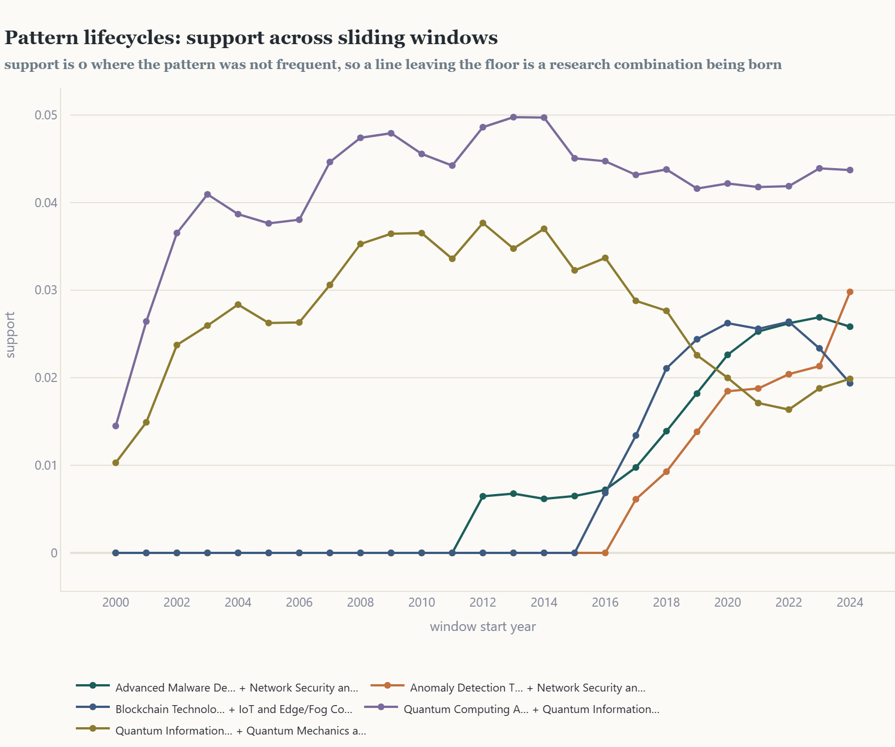
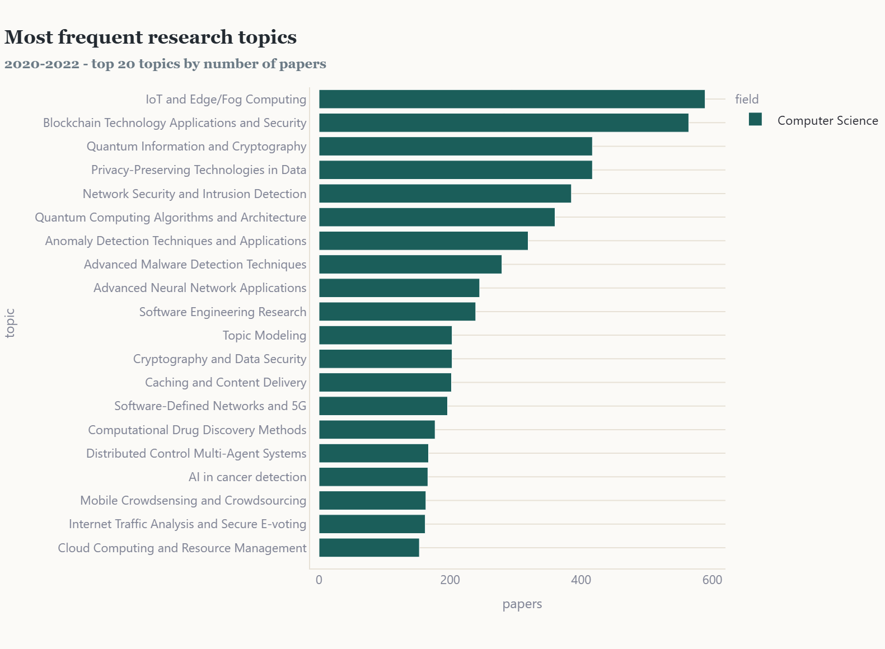
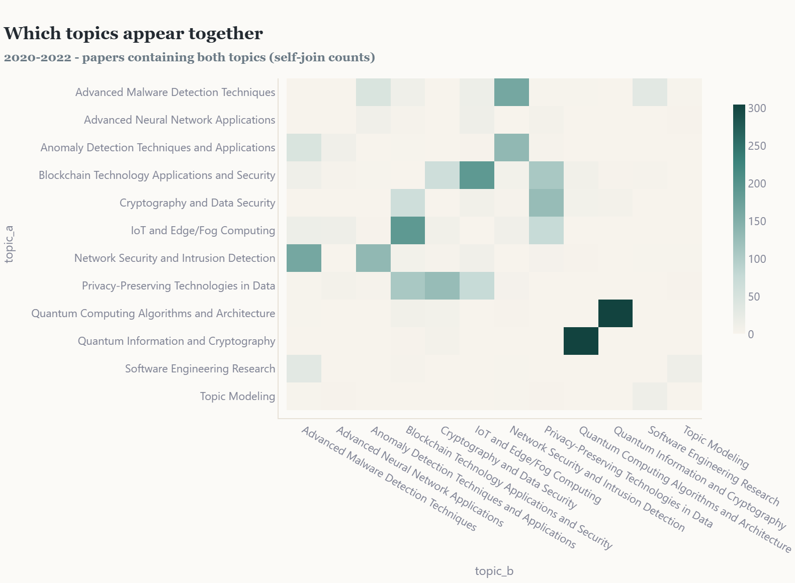
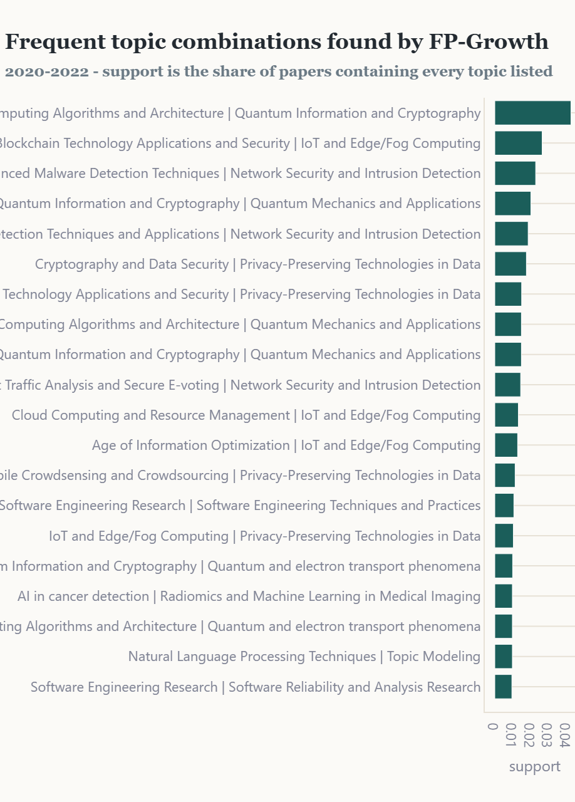
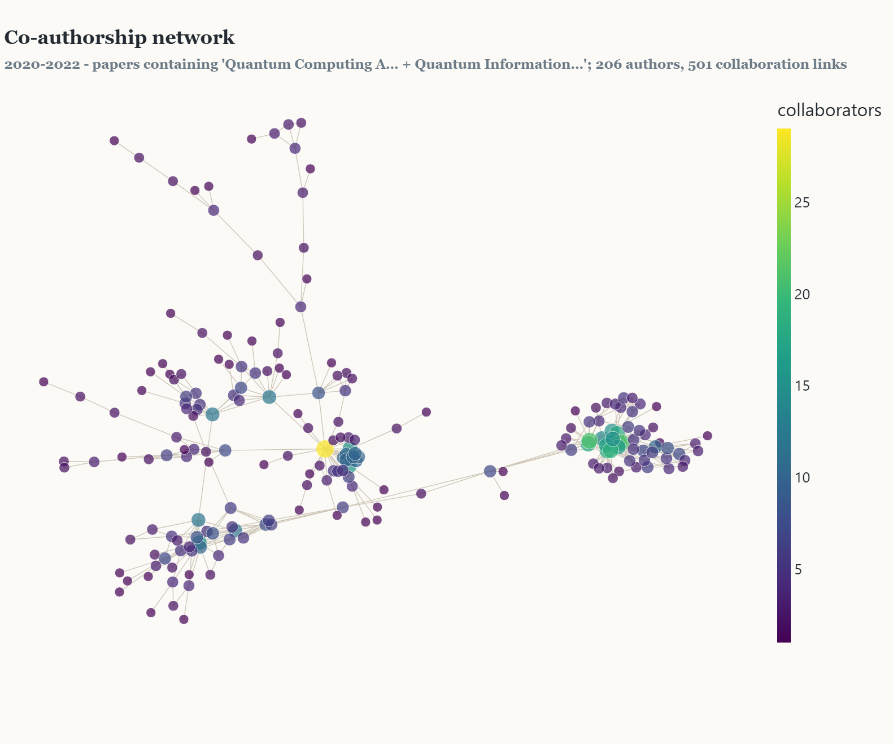

# Scholarly Pattern Explorer

Sliding-window frequent-pattern mining over the OpenAlex scholarly graph, with a
four-view visual analytics front end.

The question this answers: **which combinations of research topics are emerging,
and which is the field abandoning?** Counting single topics cannot answer that —
"machine learning" has been popular for twenty years. What actually changes is
which topics start appearing *together*, and the window in which a pair first
becomes frequent is a research direction being born.



Each line is one mined topic pair. Support is 0 in windows where the pair was not
frequent, so a line climbing off the floor is a combination being born and a line
falling to the floor is one the field left behind.

## What it does

1. Pulls papers from the OpenAlex API into JSONL, resuming from a saved cursor if
   the connection drops.
2. Loads them into a normalised database (DuckDB or SQLite) — seven tables, bulk
   inserted, indexed *after* the load.
3. Treats each paper as a *transaction* whose *items* are its topics, then runs
   FP-Growth over overlapping three-year windows and writes every frequent
   itemset and association rule back into the same database.
4. Serves four linked views over those stored results.

Storing the mined patterns alongside the raw data is what makes the front end
interactive, and what makes pattern *lifecycles* possible at all: the support of
one itemset can be drawn across 25 windows because all 25 answers are already on
disk.

## The four views

| View | What it shows |
|---|---|
| 1. Raw data | topic frequency, plus a topic-by-topic co-occurrence heatmap built with a self-join |
| 2. Mined patterns | frequent itemsets for the selected window, and association rules plotted confidence against lift |
| 3. Pattern lifecycles | support of any chosen itemsets across every window |
| 4. Co-authorship network | the collaboration graph behind the papers that contain one mined pattern |

<p align="center">
  
  
  
  
</p>

Every screenshot here is the Canadian corpus described below, in the 2020–2022
window.

View 4 is the part I did not expect to work. Scope the network to the itemset
*Quantum Computing Algorithms + Quantum Information and Cryptography* in the
2020–2022 window and it returns 206 authors and 501 collaboration links, drawn as
two dense clusters joined by a single thin bridge. The most connected author is
Alexandre Blais with 29 collaborators; the other cluster is R. Harris, Fabio
Altomare, Emile Hoskinson and T. Lanting, each around 20. Looked up by hand
afterwards, those are two of Canada's superconducting-qubit groups — Blais's
circuit-QED theory group at Sherbrooke, and the hardware team at D-Wave in
Burnaby. The pipeline surfaced two real, nameable laboratories *and* the fact that
they are separate communities; no affiliation or institution data is used
anywhere in it.

## Findings

Two corpora were mined. The headline run is **44,047 Canadian computer-science
papers, 2000–2026** (`country_code:ca`, cited 10+), 2,064 topics, 82,266 authors,
mined at `--min-support 0.005` into 5,734 pattern rows across 25 windows. A
larger run covers **188,462 papers in the Artificial Intelligence subfield**.

Change in support between the first and last window in which each pair appears:

| Emerging | Δ support | | Declining | Δ support |
|---|---|---|---|---|
| Quantum computing + quantum information | +0.029 | | Software-engineering methodologies | −0.014 |
| Anomaly detection + intrusion detection | +0.024 | | Wireless communication techniques | −0.012 |
| Malware + intrusion detection | +0.019 | | Database systems + data management | −0.012 |
| Cryptography + privacy-preserving computation | +0.015 | | Software engineering research | −0.010 |
| Blockchain + IoT | +0.013 | | Graph theory + complexity | −0.010 |
| AI in cancer detection + radiomics | +0.011 | | Fuzzy logic + neural networks | −0.009 |
| NLP + topic modelling | +0.010 | | Graph theory + graph labelling | −0.007 |

Network-security anomaly detection first clears the support threshold in the
2017–2019 window and rises from there; the fuzzy-logic/neural-network pairing
that dominated the early 2000s falls away by the mid-2010s. Neither result is
surprising to anyone who works in the field, which is the point — a miner that
did *not* recover them would be wrong.

## Limitations

**The citation filter biases the newest windows.** Keeping only papers cited ten
or more times means recent work is under-represented: 7,206 papers in 2020–2022
against 2,013 in 2024–2026, because a 2025 paper has not had time to accumulate
citations. Supports in the last two windows therefore favour fast-cited work and
should not be read as a clean measure of current activity. The emerging patterns
above all cross the threshold years before the thin windows begin, so the trends
survive, but the absolute values in 2023–2026 do not.

**Topics are OpenAlex's, not mine.** Each paper carries machine-assigned topic
labels. Errors in that assignment propagate straight into the itemsets.

**A window is three years and steps by one.** Consecutive windows share two
thirds of their papers, so the support curves are smoothed by construction; a
one-window spike is not evidence of anything.

**Support says nothing about causation.** Two topics co-occurring frequently may
share a venue, a funding programme, or a single prolific group, which is exactly
why view 4 exists — it shows you *whose* papers produced the pattern.

## Quick start

Python 3.10 or newer, and Streamlit 1.49 or newer for the front end. No API key
and no network are needed for the demo: the sample generator writes JSONL in the
real OpenAlex response shape, with three signals planted in it.

```bash
python -m venv .venv
.venv\Scripts\activate          # Windows;  source .venv/bin/activate elsewhere
pip install -r requirements.txt

python make_sample_data.py      # synthetic corpus, real JSON shape
python build_db.py              # schema, bulk load, then indexes
python mine_windows.py          # FP-Growth per window, results back into the DB
streamlit run app.py            # http://localhost:8501
```

Two commands verify the work without opening a browser:

```bash
python test_fpgrowth.py                          # miner vs brute force
python analytics.py --db data/openalex.duckdb     # every query, with row counts
```

`pip install -r requirements-dev.txt` adds mlxtend, which makes
`test_fpgrowth.py` additionally compare the miner against a second, independent
FP-Growth implementation. It is deliberately not in `requirements.txt`, since
nothing the app runs imports it.

`python check_setup.py` checks the environment first if anything looks wrong.

To mine real data, set `OPENALEX_API_KEY` in your environment (never in a file),
count before you download, then fetch:

```bash
python fetch_openalex.py --subfield-id 1702 --min-cited 20 --count-only
python fetch_openalex.py --subfield-id 1702 --min-cited 20 --max-records 200000
python build_db.py  --input data/works_real.jsonl --db data/openalex.duckdb
python mine_windows.py --db data/openalex.duckdb --min-support 0.005
```

`--count-only` spends one API call to tell you how many papers match. Use it.
A slice that is too small is worse than no slice: at roughly 175 papers per
window, a "frequent" pattern needs only three papers to qualify, and you are
mining noise.

## Files

| File | Role |
|---|---|
| `dbconn.py` | one adapter over DuckDB and SQLite, with a bulk-load fast path |
| `schema.sql` / `indexes.sql` | seven tables; indexes deliberately kept separate |
| `fpgrowth.py` | FP-Growth and association-rule generation, written from scratch |
| `test_fpgrowth.py` | checks it against brute force, and against mlxtend if installed |
| `make_sample_data.py` | synthetic corpus with planted signals |
| `build_db.py` | JSONL to database, with an orphan-row check |
| `mine_windows.py` | sliding windows, constraint push-down, results persisted |
| `analytics.py` | every SQL query in the project, with a command-line self-test |
| `app.py` | the Streamlit front end — contains no SQL at all |
| `.streamlit/config.toml` | the theme; the app injects no CSS |
| `fetch_openalex.py` | resumable OpenAlex downloader |
| `check_setup.py` | environment check |

The split between `analytics.py` and `app.py` is intentional. UI code is hard to
test and query code is easy to test, so all the SQL lives in one module with its
own CLI self-test (`python analytics.py --db data/openalex.duckdb`), and the app
is a thin rendering layer over it.

## Implementation notes

**FP-Growth is written by hand**, not imported. `test_fpgrowth.py` mines the same
transactions by brute force and asserts the two agree exactly — 363, 99 and 19
itemsets at minimum counts of 5, 15 and 40 — and additionally checks against
mlxtend when that library is available, skipping cleanly when it is not.

**Bulk loading matters more than the algorithm did.** The first version used
`executemany`, which DuckDB performs row by row, and it hung for over half an hour
on 188k papers with the indexes already in place. `DB.many()` now registers a
pandas DataFrame and runs `INSERT INTO t SELECT * FROM _bulk_rows` in 100k
chunks, and the indexes are created afterwards from `indexes.sql`. If the fast
path ever fails mid-stream it falls back to the slow path at the exact offset
reached, so no row is inserted twice.

**Sparse series must be zero-filled.** An itemset that is not frequent in a
window has no row, so a naive plot connects 2004 straight to 2013 and the
emergence disappears. `pattern_timeseries` reindexes over the full
window-by-pattern product with `fill_value=0.0`.

**Streamlit's cache ignores underscore-prefixed arguments.** That is how you pass
an unhashable database connection, but it also means switching database files in
the sidebar does not invalidate anything — the header showed one corpus while the
charts showed another. The fix is to pass the path in as an ordinary argument
purely so it joins the cache key.

**The co-authorship graph needs two filters to be readable.** Restricting it to
the papers containing every topic of one itemset, and then to the largest
connected component (union-find with path halving, no networkx dependency), turns
roughly a hundred two-person islands into one legible community.

**The downloader retries connections, not just status codes.** A dropped
connection killed an early 188k-record download at 41,200 records because only
HTTP error codes were being retried. It now backs off on any
`requests.exceptions.RequestException` and on truncated JSON, and resumes from
the cursor saved after every page.

## Data

Papers, topics and authorships come from [OpenAlex](https://openalex.org), which
is CC0. Nothing in this repository redistributes their data — `data/` is
gitignored and every database is rebuilt locally by the commands above.

The code is MIT licensed; see [LICENSE](LICENSE).
