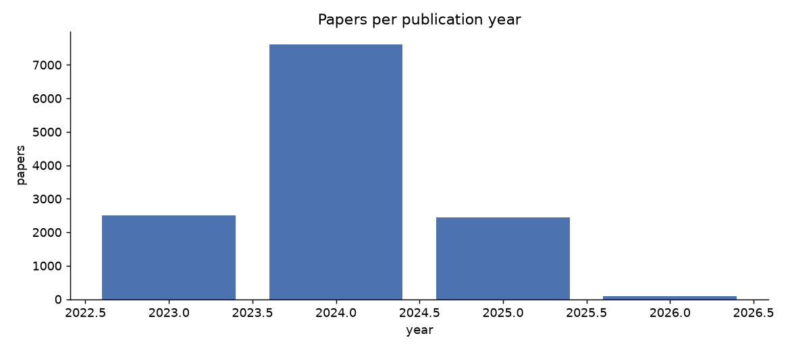
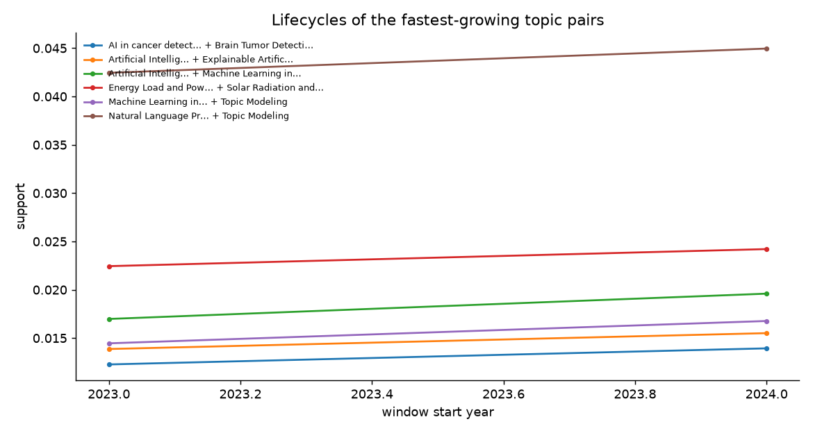
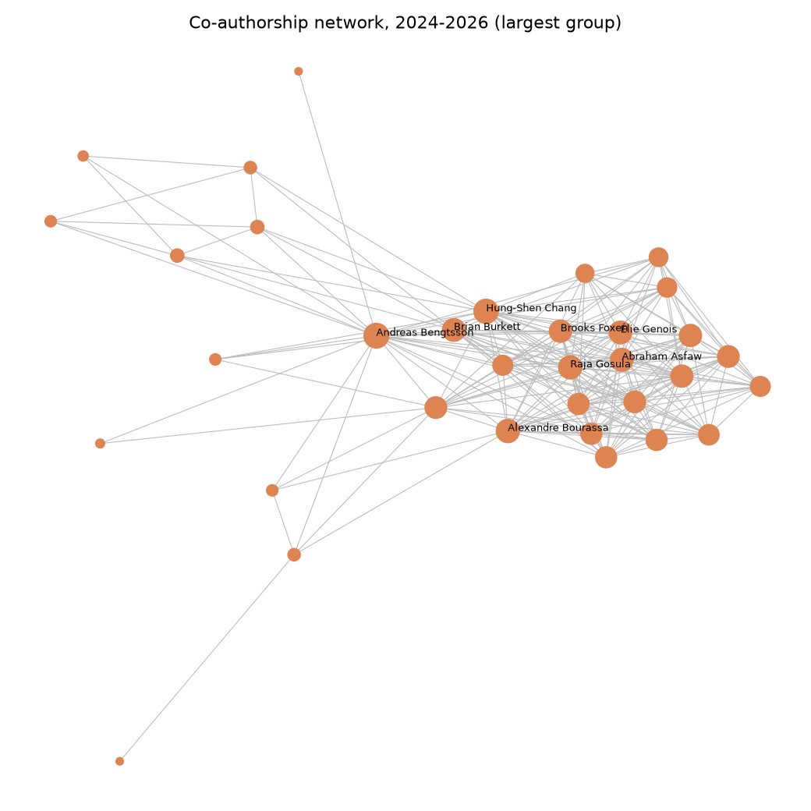
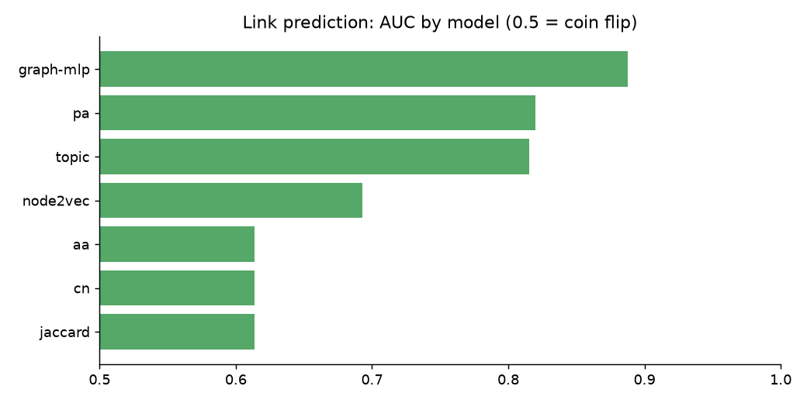

# Weekly snapshot

_Generated 2026-09-20 09:14. Corpus: 12,621 papers, 52,066 authors,
1,117 topics, publication years 2023-2026._

## Emerging topic pairs
| itemset | first_window | first_support | last_window | last_support | change |
|---|---|---|---|---|---|
| Artificial Intelligence in Healthcare and Education | Machine Learning in Healthcare | 2023 | 0.017 | 2024 | 0.0196 | 0.0026 |
| Natural Language Processing Techniques | Topic Modeling | 2023 | 0.0425 | 2024 | 0.045 | 0.0025 |
| Machine Learning in Healthcare | Topic Modeling | 2023 | 0.0145 | 2024 | 0.0168 | 0.0023 |
| Energy Load and Power Forecasting | Solar Radiation and Photovoltaics | 2023 | 0.0224 | 2024 | 0.0242 | 0.0018 |
| AI in cancer detection | Brain Tumor Detection and Classification | 2023 | 0.0123 | 2024 | 0.0139 | 0.0017 |
| Artificial Intelligence in Healthcare and Education | Explainable Artificial Intelligence (XAI) | 2023 | 0.0139 | 2024 | 0.0155 | 0.0016 |
| AI in Service Interactions | Technology Adoption and User Behaviour | 2023 | 0.0113 | 2024 | 0.0129 | 0.0016 |
| AI in Service Interactions | Online Learning and Analytics | 2023 | 0.0091 | 2024 | 0.0106 | 0.0015 |
| Quantum Computing Algorithms and Architecture | Quantum Mechanics and Applications | 2023 | 0.0185 | 2024 | 0.0198 | 0.0013 |
| Energy Load and Power Forecasting | Photovoltaic System Optimization Techniques | Solar Radiation and Photovoltaics | 2023 | 0.0162 | 2024 | 0.0174 | 0.0012 |

## Declining topic pairs
| itemset | first_window | first_support | last_window | last_support | change |
|---|---|---|---|---|---|
| Quantum Computing Algorithms and Architecture | Quantum Information and Cryptography | 2023 | 0.0681 | 2024 | 0.0651 | -0.003 |
| Mobile Crowdsensing and Crowdsourcing | Privacy-Preserving Technologies in Data | 2023 | 0.0082 | 2024 | 0.0058 | -0.0024 |
| Quantum Computing Algorithms and Architecture | Quantum and electron transport phenomena | 2023 | 0.0186 | 2024 | 0.0165 | -0.0021 |
| Advanced Multi-Objective Optimization Algorithms | Metaheuristic Optimization Algorithms Research | 2023 | 0.0207 | 2024 | 0.0188 | -0.0019 |
| Quantum Information and Cryptography | Quantum and electron transport phenomena | 2023 | 0.0179 | 2024 | 0.0161 | -0.0018 |
| Internet Traffic Analysis and Secure E-voting | Privacy-Preserving Technologies in Data | 2023 | 0.0081 | 2024 | 0.0063 | -0.0018 |
| Domain Adaptation and Few-Shot Learning | Multimodal Machine Learning Applications | 2023 | 0.0096 | 2024 | 0.0079 | -0.0017 |
| Neural Networks and Reservoir Computing | Quantum Computing Algorithms and Architecture | 2023 | 0.0071 | 2024 | 0.0054 | -0.0016 |
| Quantum Computing Algorithms and Architecture | Quantum Information and Cryptography | Quantum and electron transport phenomena | 2023 | 0.0159 | 2024 | 0.0143 | -0.0016 |
| Advanced Multi-Objective Optimization Algorithms | Evolutionary Algorithms and Applications | 2023 | 0.0131 | 2024 | 0.0116 | -0.0015 |

## Strongest patterns in 2024-2026
| itemset | k | support_count | n_tx | support |
|---|---|---|---|---|
| Quantum Computing Algorithms and Architecture | Quantum Information and Cryptography | 2 | 621 | 9542 | 0.0650806958708866 |
| Natural Language Processing Techniques | Topic Modeling | 2 | 429 | 9542 | 0.04495912806539509 |
| AI in cancer detection | Radiomics and Machine Learning in Medical Imaging | 2 | 391 | 9542 | 0.0409767344372249 |
| Cryptography and Data Security | Privacy-Preserving Technologies in Data | 2 | 294 | 9542 | 0.030811150702158875 |
| Photovoltaic System Optimization Techniques | Solar Radiation and Photovoltaics | 2 | 240 | 9542 | 0.02515195975686439 |
| Quantum Information and Cryptography | Quantum Mechanics and Applications | 2 | 238 | 9542 | 0.024942360092223854 |
| Anomaly Detection Techniques and Applications | Network Security and Intrusion Detection | 2 | 236 | 9542 | 0.024732760427583315 |
| Energy Load and Power Forecasting | Solar Radiation and Photovoltaics | 2 | 231 | 9542 | 0.024208761265981975 |
| Evolutionary Algorithms and Applications | Metaheuristic Optimization Algorithms Research | 2 | 214 | 9542 | 0.022427164116537415 |
| Quantum Computing Algorithms and Architecture | Quantum Mechanics and Applications | 2 | 189 | 9542 | 0.019807168308530708 |

## Collaboration network, 2024-2026
| author | collaborators | joint_papers |
|---|---|---|
| Andreas Bengtsson | 24 | 103 |
| Hung-Shen Chang | 23 | 94 |
| Alexandre Bourassa | 21 | 89 |
| Raja Gosula | 21 | 84 |
| Brian Burkett | 20 | 82 |
| Abraham Asfaw | 20 | 80 |
| Élie Genois | 20 | 80 |
| Brooks Foxen | 19 | 76 |
| Joseph C. Bardin | 19 | 76 |
| Sean D. Harrington | 19 | 76 |

## Link prediction
_no rows_

Top predicted collaborations: [data/predicted_collaborations.csv](data/predicted_collaborations.csv)
