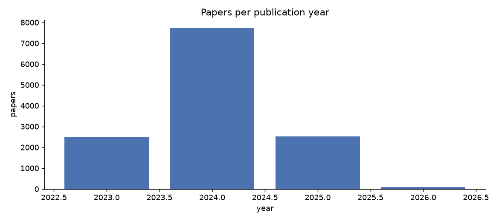
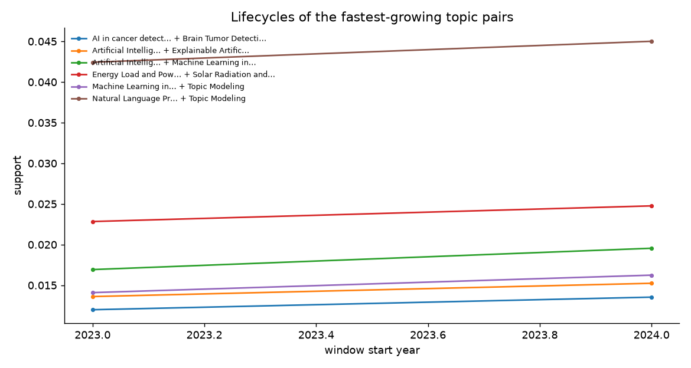
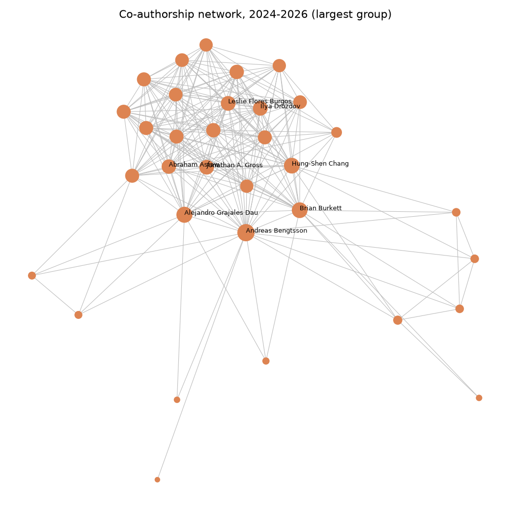
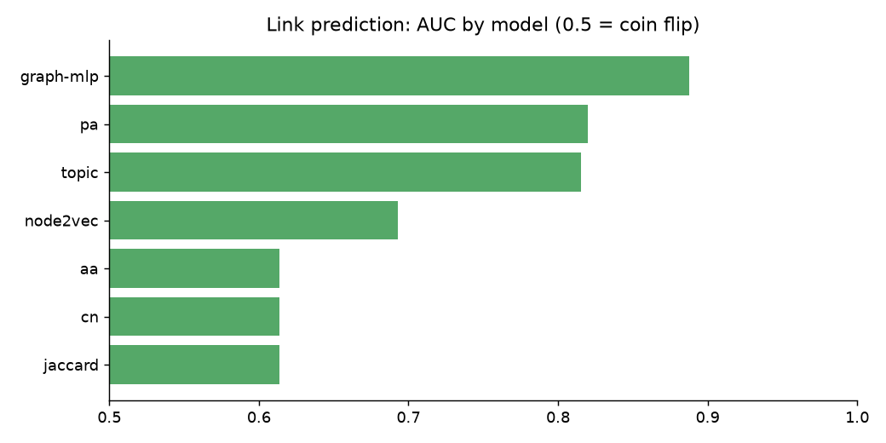

# Weekly snapshot

_Generated 2026-09-27 09:58. Corpus: 12,854 papers, 52,971 authors,
1,123 topics, publication years 2023-2026._

## Emerging topic pairs
| itemset | first_window | first_support | last_window | last_support | change |
|---|---|---|---|---|---|
| Artificial Intelligence in Healthcare and Education | Machine Learning in Healthcare | 2023 | 0.0169 | 2024 | 0.0195 | 0.0026 |
| Natural Language Processing Techniques | Topic Modeling | 2023 | 0.0426 | 2024 | 0.0453 | 0.0026 |
| Machine Learning in Healthcare | Topic Modeling | 2023 | 0.0142 | 2024 | 0.0164 | 0.0022 |
| Energy Load and Power Forecasting | Solar Radiation and Photovoltaics | 2023 | 0.0228 | 2024 | 0.0247 | 0.0019 |
| AI in cancer detection | Brain Tumor Detection and Classification | 2023 | 0.0121 | 2024 | 0.0138 | 0.0016 |
| Artificial Intelligence in Healthcare and Education | Explainable Artificial Intelligence (XAI) | 2023 | 0.0138 | 2024 | 0.0154 | 0.0016 |
| AI in Service Interactions | Technology Adoption and User Behaviour | 2023 | 0.0112 | 2024 | 0.0127 | 0.0016 |
| AI in Service Interactions | Online Learning and Analytics | 2023 | 0.0091 | 2024 | 0.0106 | 0.0015 |
| Quantum Computing Algorithms and Architecture | Quantum Mechanics and Applications | 2023 | 0.0183 | 2024 | 0.0196 | 0.0013 |
| Energy Load and Power Forecasting | Photovoltaic System Optimization Techniques | 2023 | 0.0165 | 2024 | 0.0179 | 0.0013 |

## Declining topic pairs
| itemset | first_window | first_support | last_window | last_support | change |
|---|---|---|---|---|---|
| Quantum Computing Algorithms and Architecture | Quantum Information and Cryptography | 2023 | 0.0677 | 2024 | 0.0648 | -0.003 |
| Mobile Crowdsensing and Crowdsourcing | Privacy-Preserving Technologies in Data | 2023 | 0.0081 | 2024 | 0.0057 | -0.0023 |
| Quantum Computing Algorithms and Architecture | Quantum and electron transport phenomena | 2023 | 0.0184 | 2024 | 0.0163 | -0.0021 |
| Internet Traffic Analysis and Secure E-voting | Privacy-Preserving Technologies in Data | 2023 | 0.0081 | 2024 | 0.0064 | -0.0017 |
| Advanced Multi-Objective Optimization Algorithms | Metaheuristic Optimization Algorithms Research | 2023 | 0.0207 | 2024 | 0.019 | -0.0017 |
| Domain Adaptation and Few-Shot Learning | Multimodal Machine Learning Applications | 2023 | 0.0097 | 2024 | 0.008 | -0.0017 |
| Quantum Information and Cryptography | Quantum and electron transport phenomena | 2023 | 0.0178 | 2024 | 0.0161 | -0.0017 |
| Quantum Computing Algorithms and Architecture | Quantum Information and Cryptography | Quantum and electron transport phenomena | 2023 | 0.0158 | 2024 | 0.0142 | -0.0016 |
| Neural Networks and Reservoir Computing | Quantum Computing Algorithms and Architecture | 2023 | 0.007 | 2024 | 0.0054 | -0.0016 |
| Advanced Multi-Objective Optimization Algorithms | Evolutionary Algorithms and Applications | 2023 | 0.013 | 2024 | 0.0115 | -0.0015 |

## Strongest patterns in 2024-2026
| itemset | k | support_count | n_tx | support |
|---|---|---|---|---|
| Quantum Computing Algorithms and Architecture | Quantum Information and Cryptography | 2 | 631 | 9744 | 0.06475779967159277 |
| Natural Language Processing Techniques | Topic Modeling | 2 | 441 | 9744 | 0.04525862068965517 |
| AI in cancer detection | Radiomics and Machine Learning in Medical Imaging | 2 | 396 | 9744 | 0.04064039408866995 |
| Cryptography and Data Security | Privacy-Preserving Technologies in Data | 2 | 297 | 9744 | 0.030480295566502464 |
| Photovoltaic System Optimization Techniques | Solar Radiation and Photovoltaics | 2 | 250 | 9744 | 0.025656814449917898 |
| Energy Load and Power Forecasting | Solar Radiation and Photovoltaics | 2 | 241 | 9744 | 0.024733169129720855 |
| Quantum Information and Cryptography | Quantum Mechanics and Applications | 2 | 240 | 9744 | 0.024630541871921183 |
| Anomaly Detection Techniques and Applications | Network Security and Intrusion Detection | 2 | 239 | 9744 | 0.024527914614121512 |
| Evolutionary Algorithms and Applications | Metaheuristic Optimization Algorithms Research | 2 | 215 | 9744 | 0.022064860426929393 |
| Quantum Computing Algorithms and Architecture | Quantum Mechanics and Applications | 2 | 191 | 9744 | 0.019601806239737275 |

## Collaboration network, 2024-2026
| author | collaborators | joint_papers |
|---|---|---|
| Andreas Bengtsson | 24 | 103 |
| Alejandro Grajales Dau | 22 | 90 |
| Brian Burkett | 22 | 90 |
| Hung-Shen Chang | 22 | 90 |
| Joseph C. Bardin | 21 | 84 |
| Ilya Drozdov | 20 | 80 |
| Raja Gosula | 20 | 80 |
| Alexandre Bourassa | 19 | 81 |
| Abraham Asfaw | 19 | 76 |
| Brooks Foxen | 19 | 76 |

## Link prediction
_no rows_

Top predicted collaborations: [data/predicted_collaborations.csv](data/predicted_collaborations.csv)
