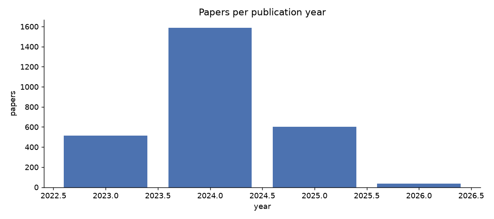
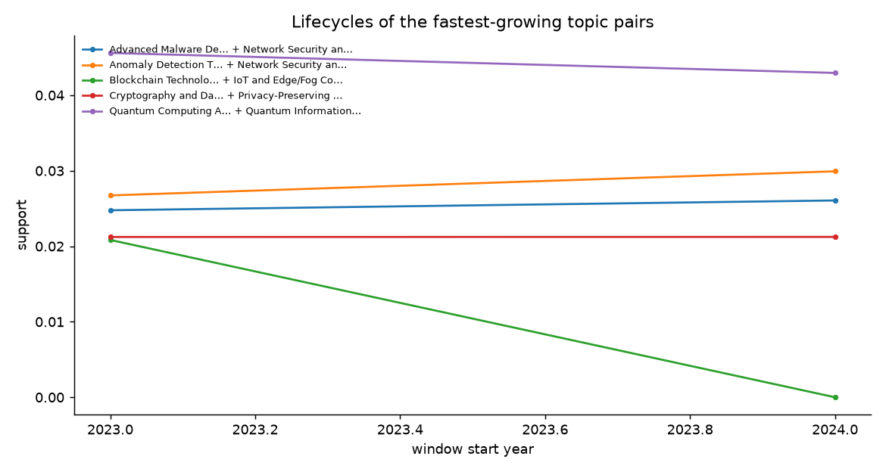
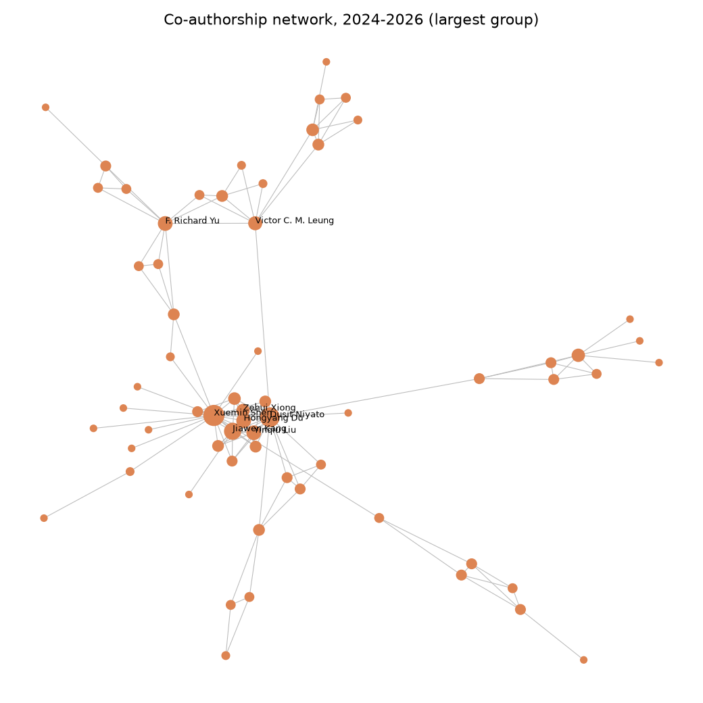
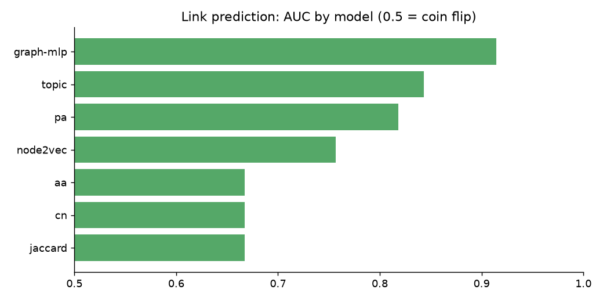

# Weekly snapshot

_Generated 2026-09-15 18:41. Corpus: 2,717 papers, 12,844 authors,
854 topics, publication years 2023-2026._

## Emerging topic pairs
| itemset | first_window | first_support | last_window | last_support | change |
|---|---|---|---|---|---|
| Anomaly Detection Techniques and Applications | Network Security and Intrusion Detection | 2023 | 0.0267 | 2024 | 0.0299 | 0.0032 |
| Advanced Malware Detection Techniques | Network Security and Intrusion Detection | 2023 | 0.0248 | 2024 | 0.0261 | 0.0013 |
| Cryptography and Data Security | Privacy-Preserving Technologies in Data | 2023 | 0.0212 | 2024 | 0.0212 | 0.0 |
| Blockchain Technology Applications and Security | IoT and Edge/Fog Computing | 2023 | 0.0208 | 2023 | 0.0208 | 0.0 |
| Quantum Computing Algorithms and Architecture | Quantum Information and Cryptography | 2023 | 0.0456 | 2024 | 0.043 | -0.0026 |

## Declining topic pairs
| itemset | first_window | first_support | last_window | last_support | change |
|---|---|---|---|---|---|
| Quantum Computing Algorithms and Architecture | Quantum Information and Cryptography | 2023 | 0.0456 | 2024 | 0.043 | -0.0026 |
| Blockchain Technology Applications and Security | IoT and Edge/Fog Computing | 2023 | 0.0208 | 2023 | 0.0208 | 0.0 |
| Cryptography and Data Security | Privacy-Preserving Technologies in Data | 2023 | 0.0212 | 2024 | 0.0212 | 0.0 |
| Advanced Malware Detection Techniques | Network Security and Intrusion Detection | 2023 | 0.0248 | 2024 | 0.0261 | 0.0013 |
| Anomaly Detection Techniques and Applications | Network Security and Intrusion Detection | 2023 | 0.0267 | 2024 | 0.0299 | 0.0032 |

## Strongest patterns in 2024-2026
| itemset | k | support_count | n_tx | support |
|---|---|---|---|---|
| Quantum Computing Algorithms and Architecture | Quantum Information and Cryptography | 2 | 89 | 2072 | 0.04295366795366795 |
| Anomaly Detection Techniques and Applications | Network Security and Intrusion Detection | 2 | 62 | 2072 | 0.029922779922779922 |
| Advanced Malware Detection Techniques | Network Security and Intrusion Detection | 2 | 54 | 2072 | 0.026061776061776062 |
| Cryptography and Data Security | Privacy-Preserving Technologies in Data | 2 | 44 | 2072 | 0.021235521235521235 |

## Collaboration network, 2024-2026
| author | collaborators | joint_papers |
|---|---|---|
| Xuemin Shen | 21 | 113 |
| Dusit Niyato | 18 | 106 |
| Habib Hamam | 17 | 87 |
| Jiawen Kang | 12 | 73 |
| Roberto Morandotti | 12 | 39 |
| Rongxing Lu | 10 | 40 |
| Hongyang Du | 9 | 60 |
| F. Richard Yu | 9 | 37 |
| Witold Pedrycz | 9 | 36 |
| David Moss | 9 | 28 |

## Link prediction
| model | auc | ap |
|---|---|---|
| graph-mlp | 0.91453636 | 0.9300244 |
| topic | 0.84341997 | 0.82834053 |
| pa | 0.81823343 | 0.8359255 |
| node2vec | 0.7564105 | 0.78495276 |
| aa | 0.6672695 | 0.6669321 |
| cn | 0.6672423 | 0.6668721 |
| jaccard | 0.6670818 | 0.6659139 |

Top predicted collaborations: [data/predicted_collaborations.csv](data/predicted_collaborations.csv)
