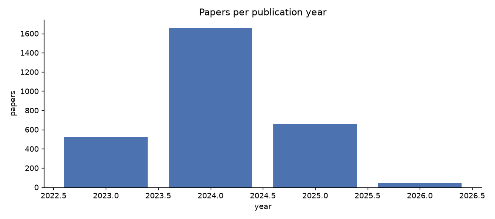
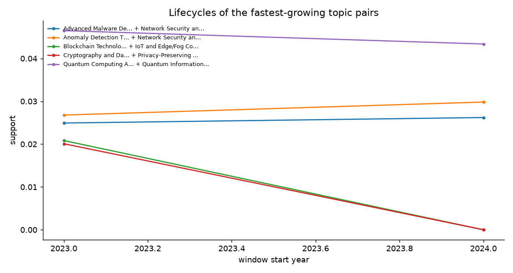
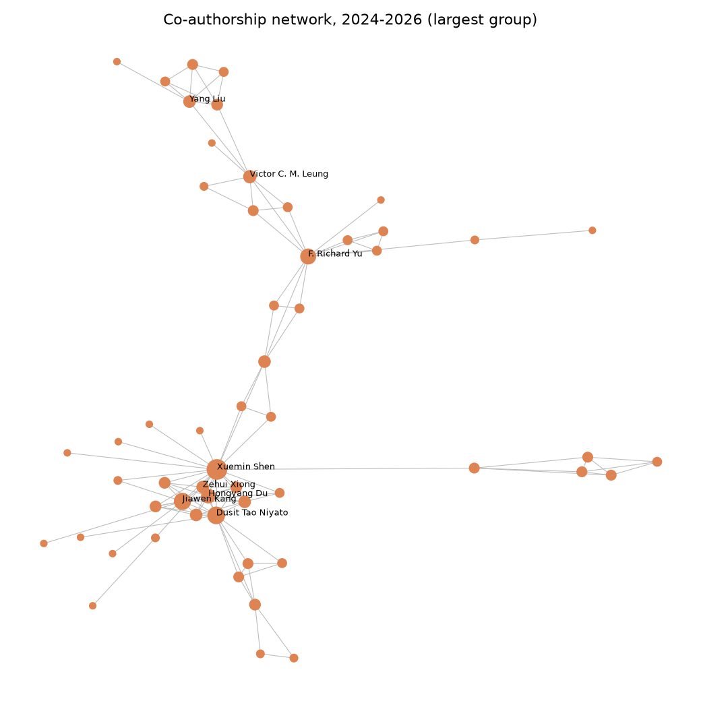
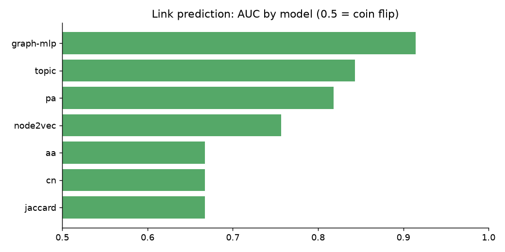

# Weekly snapshot

_Generated 2026-10-04 10:33. Corpus: 2,880 papers, 13,485 authors,
877 topics, publication years 2023-2026._

## Emerging topic pairs
| itemset | first_window | first_support | last_window | last_support | change |
|---|---|---|---|---|---|
| Anomaly Detection Techniques and Applications | Network Security and Intrusion Detection | 2023 | 0.0268 | 2024 | 0.0298 | 0.003 |
| Advanced Malware Detection Techniques | Network Security and Intrusion Detection | 2023 | 0.0249 | 2024 | 0.0262 | 0.0013 |
| Blockchain Technology Applications and Security | IoT and Edge/Fog Computing | 2023 | 0.0208 | 2023 | 0.0208 | 0.0 |
| Cryptography and Data Security | Privacy-Preserving Technologies in Data | 2023 | 0.0201 | 2023 | 0.0201 | 0.0 |
| Quantum Computing Algorithms and Architecture | Quantum Information and Cryptography | 2023 | 0.0465 | 2024 | 0.0434 | -0.0031 |

## Declining topic pairs
| itemset | first_window | first_support | last_window | last_support | change |
|---|---|---|---|---|---|
| Quantum Computing Algorithms and Architecture | Quantum Information and Cryptography | 2023 | 0.0465 | 2024 | 0.0434 | -0.0031 |
| Cryptography and Data Security | Privacy-Preserving Technologies in Data | 2023 | 0.0201 | 2023 | 0.0201 | 0.0 |
| Blockchain Technology Applications and Security | IoT and Edge/Fog Computing | 2023 | 0.0208 | 2023 | 0.0208 | 0.0 |
| Advanced Malware Detection Techniques | Network Security and Intrusion Detection | 2023 | 0.0249 | 2024 | 0.0262 | 0.0013 |
| Anomaly Detection Techniques and Applications | Network Security and Intrusion Detection | 2023 | 0.0268 | 2024 | 0.0298 | 0.003 |

## Strongest patterns in 2024-2026
| itemset | k | support_count | n_tx | support |
|---|---|---|---|---|
| Quantum Computing Algorithms and Architecture | Quantum Information and Cryptography | 2 | 96 | 2213 | 0.04338002711251695 |
| Anomaly Detection Techniques and Applications | Network Security and Intrusion Detection | 2 | 66 | 2213 | 0.0298237686398554 |
| Advanced Malware Detection Techniques | Network Security and Intrusion Detection | 2 | 58 | 2213 | 0.026208766380478987 |

## Collaboration network, 2024-2026
| author | collaborators | joint_papers |
|---|---|---|
| Xuemin Shen | 21 | 113 |
| Habib Hamam | 17 | 94 |
| Dusit Tao Niyato | 14 | 92 |
| Jiawen Kang | 13 | 72 |
| Roberto Morandotti | 12 | 39 |
| Hongyang Du | 9 | 60 |
| F. Richard Yu | 9 | 37 |
| Witold Pedrycz | 9 | 36 |
| David Moss | 9 | 28 |
| Kai Zhang | 9 | 18 |

## Link prediction
| model | auc | ap |
|---|---|---|
| graph-mlp | 0.91453636 | 0.9300244 |
| topic | 0.84341997 | 0.82834053 |
| pa | 0.81823343 | 0.8359255 |
| node2vec | 0.7564105 | 0.78495276 |
| aa | 0.6672695 | 0.6669321 |
| cn | 0.6672423 | 0.6668721 |
| jaccard | 0.6670818 | 0.6659139 |

Top predicted collaborations: [data/predicted_collaborations.csv](data/predicted_collaborations.csv)
